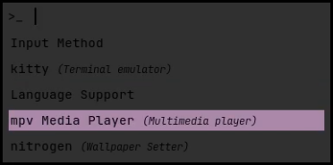

# simple linux dotfiles (~_wip_)

these are my dotfiles that i use on linux. they are based on a minimal style.

## todos

+ vscode keybindings.json and settings.json
+ use local vscode persoal themes (.vsix) instead of leaning on vscode marketplace
+ add imgs to this readme when finished

## requirements

install these to make everything work:
+ [bspwm](https://github.com/baskerville/bspwm)
+ [feh](https://feh.finalrewind.org/)
+ [kitty](https://sw.kovidgoyal.net/kitty/)
+ [neofetch](https://github.com/dylanaraps/neofetch)
+ [nitrogen](https://wiki.archlinux.org/title/Nitrogen)
+ [playerctl](https://github.com/altdesktop/playerctl)
+ [polybar](https://github.com/polybar/polybar)
+ [rofi](https://github.com/davatorium/rofi)
+ [slock](https://wiki.archlinux.org/title/Slock)
+ [sxhkd](https://github.com/baskerville/sxhkd)
+ [nemo](https://github.com/linuxmint/nemo)
+ [jetbrains mono nerd font](https://www.nerdfonts.com/font-downloads)

## programs

here's a list of software i customized:
+ bspwm, a tiling window manager based on binary trees
    + 
+ kitty, a terminal emulator
    + 
+ polybar, a status bar
+ rofi
    + run, window, filebrowser
        + 
    + custom scripts
        + power menu
            + 
        + wifi
            + 
        + wallpapers
            + 
+ sxhkd

> NB: information of network and battery can be obtained with these two commands:
> 1. ip link
> 2. ls -1 /sys/class/power_supply/

---

i also added some [wallpapers](https://github.com/dellarosciagiorgio/dotfiles/blob/main/wallpapers/README.md) that i made.