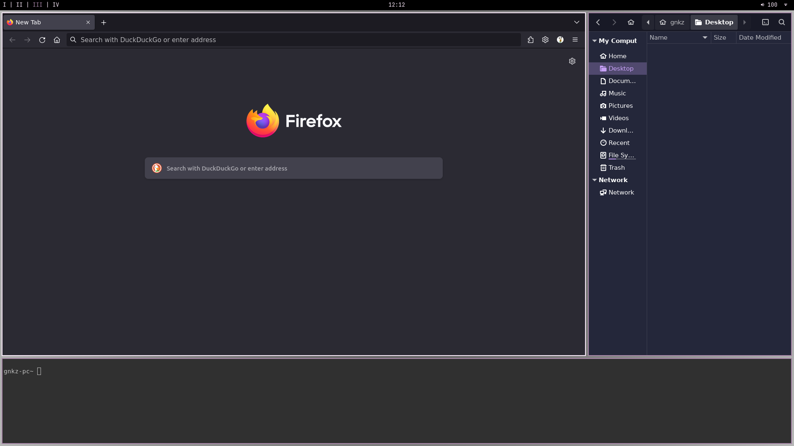
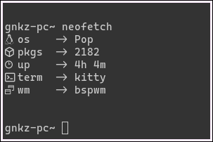

# simple linux dotfiles (~_wip_)

these are my dotfiles that i use on linux. they are based on a minimal style.

## todos

+ use local vscode personal themes (.vsix) instead of leaning on vscode marketplace

## requirements

install these to make everything work:
+ [bspwm](https://github.com/baskerville/bspwm)
+ [feh](https://feh.finalrewind.org/)
+ [kitty](https://sw.kovidgoyal.net/kitty/)
+ [neofetch](https://github.com/dylanaraps/neofetch)
+ [nitrogen](https://wiki.archlinux.org/title/Nitrogen)
+ [playerctl](https://github.com/altdesktop/playerctl)
+ [brightnessctl](https://github.com/Hummer12007/brightnessctl)
+ [polybar](https://github.com/polybar/polybar)
+ [rofi](https://github.com/davatorium/rofi)
+ [slock](https://wiki.archlinux.org/title/Slock)
+ [sxhkd](https://github.com/baskerville/sxhkd)

## programs

here's a list of software i customized:
+ bspwm, polybar
        

+ kitty
        

+ rofi: run, window, powermenu, wifi, wallpapers
            

> NB: information of network and battery can be obtained with these two commands:
> 1. ip link
> 2. ls -1 /sys/class/power_supply/