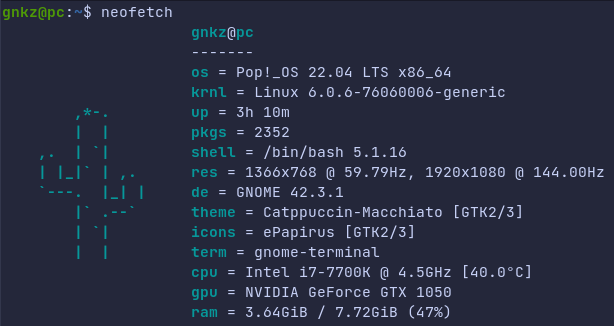
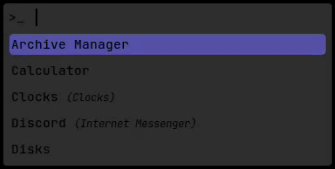

# **linux dotfiles** (_wip_)

these are my dotfiles that i use on linux. they are based on a basic style, this is due to two factors:
1. i like a minimal look;
1. i really can't do more complicated things.

i also added some wallpapers: some are mine, many others are not.

---

### _**neofetch**_

### _**rofi**_

